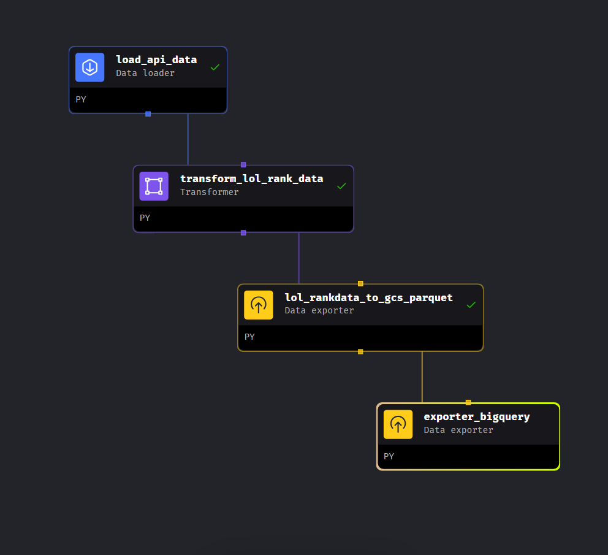
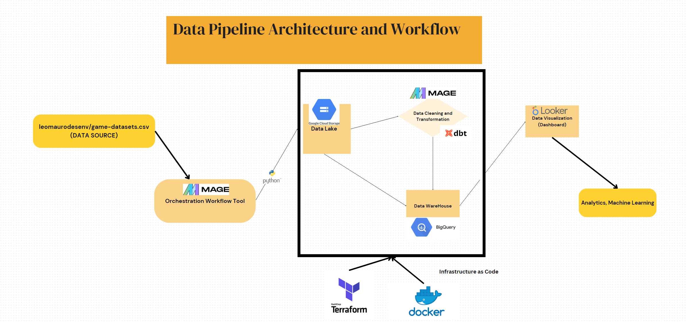
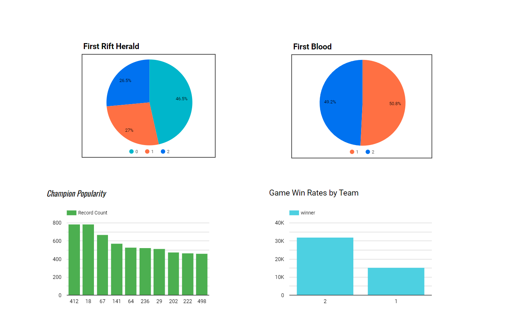
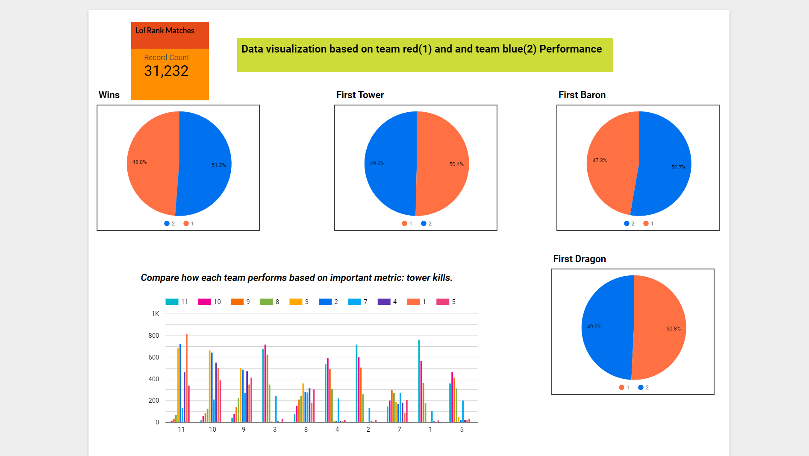

# ETL data pipeline for LOL rank matches

### Introduction
League of lengends has been one of my favorite game since it was launched so i think why dont i start figuring out how to do something with the data of it. It turns out that some online sources already did the best dashboards i could imagine. However, I thought that there could always be more queries to be run to explore data from some other angles. As a Lol rank player, I would like to see the statistics about different rank matches to analyze and come up with some strategies for my own game.

### The ETL process:

I download the datasets from https://github.com/leomaurodesenv/game-datasets.
### Technologies:
Cloud: Google Cloud Platform

Infrastructure as code (IaC): Docker, Terraform

Workflow orchestration: Mage AI

Data Warehouse: Google Big Query

Data Lake: Google Cloud Storage

Batch processing: SQL, Python, Spark Apache.

Dashboard: Looker Studio.

## Data Pipeline Architecture and Workflow:

## Data ingestion (batch) & Workflow orchestration

Pipelines running in Mage AI in a Mage Docker container.

## Data Warehouse Bigquery

## Mage is deployed on Google Cloud using Terraform.
 
## Dashboard:

---------------------------------------------------------

